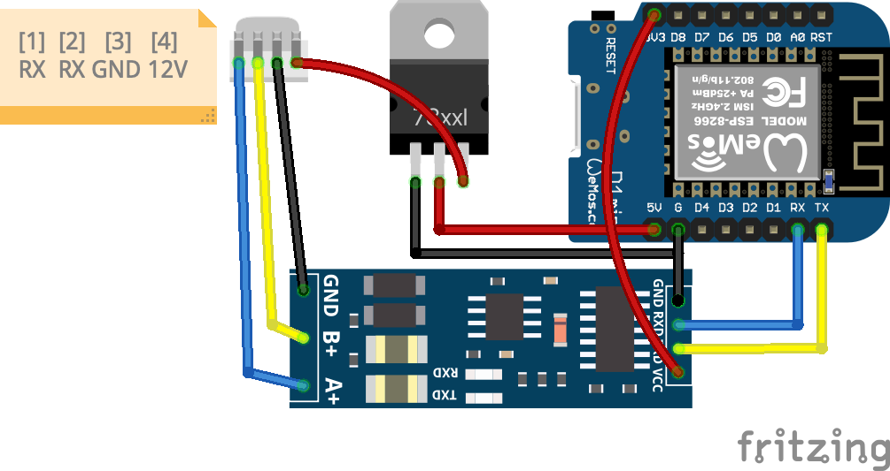

# Wemos D1 mini를 사용한 아파트 월패드 RS485-MQTT 브릿지 모듈

## 1. 프로젝트 개요

아파트 내부 RS485 네트워크(월패드-각 가전기기 간 통신)에 접속하여 데이터를 모니터링하고 제어 명령을 전달하는 하이브리드 IoT 게이트웨이 구축.

## 2. 시스템 아키텍처

Physical Layer: 월패드 RS485 라인 (9600bps, 12V 전원부 활용)
Transport Layer: WiFi (802.11 b/g/n)
Application Layer: MQTT (v3.1.1), WebSocket (실시간 로그), HTTP (설정 및 제어)

## 3. 기능 상세 정의 (Functional Requirements)

### 3.1 네트워크 및 설정 관리

- Provisioning: 저장된 WiFi 정보가 없거나 접속 실패 시 자동으로 AP 모드(Captive Portal) 진입.
- Web Configuration: 전용 웹 페이지(/wifi.htm)를 통해 SSID 스캔 및 비밀번호 설정.
- Persistence: LittleFS를 사용하여 WiFi 설정(config.json) 및 기기 프리셋(preset.json)을 파일 시스템에 보관.

### 3.2 RS485 통신 및 디버깅

- Bidirectional Bridge: RS485 수신 패킷을 MQTT Topic으로 발행하고, 특정 Topic의 수신 메시지를 RS485 패킷으로 변환 송신.
- WebSocket Debugging: /monitor.htm 접속 시 Serial 데이터를 실시간으로 웹 브라우저에 스트리밍하여 현장 분석 지원.
- Binary Sensing: 3채널의 바이너리 입력을 통해 RS485 외 별도 접점 신호(예: 현관 센서 등) 감시.

### 3.3 Home Assistant 연동

- MQTT Discovery: HA가 모듈을 자동으로 인식하도록 구성(Option)하거나, 정해진 JSON 포맷으로 상태 전달.
- Availability: LWT(Last Will and Testament)를 통해 모듈의 온라인/오프라인 상태 실시간 감시.

### 3.4 RS485 통신 규격

wallpad_protocol.md 참조
([파일 링크](./wallpad_protocol.md))

## 4. 하드웨어 설계 (Hardware Specifications)

### 4.1 주요 부품 리스트

- MCU: Wemos D1 Mini (ESP8266)
- Interface: XY-017 RS485-TTL 컨버터 (자동 방향 제어 기능 포함)
- Power: 12V to 5V DC-DC Stepdown (AMS1117-5V 사용 시 방열 주의, 고효율을 위해 Buck Converter 권장)
- Input Protection: 바이너리 센싱용 포토커플러 회로 (12V 입력 대응)

### 4.2 핀 맵 (Pin Mapping)

| 기능            | Wemos D1 Mini | GPIO   | 비고                                   |
| :-------------- | :------------ | :----- | :------------------------------------- |
| **RS485 RX**    | **D2**        | GPIO4  | SoftwareSerial RX (12V 레벨 변환 필수) |
| **RS485 TX**    | **D1**        | GPIO5  | SoftwareSerial TX                      |
| **Binary In 1** | **D5**        | GPIO14 | 12V 신호 입력 (포토커플러 경유)        |
| **Binary In 2** | **D6**        | GPIO12 | 12V 신호 입력 (포토커플러 경유)        |
| **Binary In 3** | **D7**        | GPIO13 | 12V 신호 입력 (포토커플러 경유)        |
| **Power In**    | **5V / GND**  | -      | AMS1117-5V 출력 연결                   |

## 5. 소프트웨어 스택 (Library Stack)

PlatformIO 환경에서 다음 라이브러리를 조합하여 구현합니다.

Framework: Arduino

Async WebServer: ESPAsyncWebServer & ESPAsyncTCP (비동기 처리로 시리얼 데이터 유실 방지)

MQTT Client: PubSubClient

JSON Parser: ArduinoJson

File System: LittleFS (SPIFFS 대비 안정성 및 속도 우위)

### 4.3 회로

<table>
  <tr>
    <td></td>
    <td></td>
  </tr>
</table>

### 6. 인터페이스 명세 (Endpoints)

| Endpoint        | Method   | Description                                    |
| :-------------- | :------- | :--------------------------------------------- |
| `/`             | GET      | 시스템 상태 대시보드 및 메인 홈 페이지         |
| `/monitor.htm`  | GET      | 실시간 시리얼 로그 뷰어 (WebSocket 연동)       |
| `/wifi.htm`     | GET/POST | WiFi 설정 관리 및 스캔 결과 확인               |
| `/ws`           | WS       | Serial <-> Web 인터페이스 실시간 데이터 스트림 |
| `/scan`         | GET      | 주변 WiFi AP 리스트 스캔 및 JSON 반환          |
| `/wifistatus`   | GET      | 현재 연결 상태 및 스캔 결과 데이터             |
| `/wifireset`    | POST     | 저장된 WiFi 설정 삭제 및 모듈 재부팅           |
| `/connect2ssid` | POST     | SSID 및 비밀번호 수신/저장                     |
| `/savepreset`   | POST     | RS485 제어 프리셋 데이터 저장                  |
| `/preset.ini`   | GET      | 저장된 프리셋 파일 다운로드/조회               |

## 7. 향후 고려 사항 (Manager's Note)

Watchdog: WiFi 루프나 MQTT 재접속 로직에서 Blocking이 발생하지 않도록 Ticker 라이브러리 활용 검토.
Security: 웹 설정 페이지 진입 시 관리자 암호 인증 적용.
OTA: 현장 설치 후 펌웨어 업데이트를 위한 AsyncElegantOTA 통합 고려.

---

## 8. 개발 현황 및 로드맵 (Development Status & Roadmap)

### 8.1 현재 구현 상태 (Current Implementation Status)

#### ✅ 구현 완료 (Completed)

- [x] **기본 하드웨어 설정**
  - Wemos D1 Mini + XY-017 RS485 컨버터 연동
  - SoftwareSerial을 통한 RS485 송수신
  - 핀맵 정의 및 회로 설계
- [x] **WiFi 네트워크 기능**
  - WiFi Station 모드 연결
  - AP 모드 자동 전환 (연결 실패 시)
  - LittleFS 기반 설정 저장/로드
- [x] **기본 웹 서버**
  - AsyncWebServer 기반 비동기 HTTP 서버
  - LittleFS를 통한 정적 파일 서빙
  - WebSocket (/ws) 실시간 통신 채널
- [x] **MQTT 클라이언트**
  - PubSubClient 기반 MQTT 연결
  - 기본 publish/subscribe 골격
- [x] **유틸리티 모듈**
  - XOR 및 ADD 체크섬 계산 함수
  - Hex 문자열 변환 함수
- [x] **프로토콜 문서화**
  - RS485 통신 규약 상세 명세 (wallpad_protocol.md)

#### 🚧 미완성 또는 개선 필요 (In Progress / Need Improvement)

- [ ] **RS485 프로토콜 파싱**
  - 현재: Raw 데이터만 수신/전송
  - 필요: 프레임 파싱, 장치 타입 식별, 상태값 추출
- [ ] **장치별 제어 로직**
  - 조명, 환기, 난방 등 각 장치 타입별 처리 미구현
  - 상태 관리 및 명령 생성 로직 없음
- [ ] **Binary 센서 입력**
  - D5, D6, D7 핀 초기화 및 인터럽트 처리 미구현
- [ ] **Home Assistant MQTT Discovery**
  - 자동 장치 등록 메시지 생성 미구현
- [ ] **웹 UI 완성도**
  - /wifi.htm: WiFi 스캔 및 저장 기능 부분 구현
  - /monitor.htm: 실시간 로그 뷰어 구조만 존재
  - /index.htm: 대시보드 기능 미완성
- [ ] **OTA 펌웨어 업데이트**
  - AsyncElegantOTA 라이브러리 포함되었으나 미활성화
- [ ] **Watchdog 및 안정성**
  - WiFi/MQTT 재연결 시 타임아웃 로직 부족
  - 하드웨어 Watchdog 타이머 미구현
- [ ] **보안 기능**
  - 웹 페이지 접근 인증 없음
  - MQTT 인증 하드코딩 상태
- [ ] **프리셋 시스템**
  - /savepreset 엔드포인트 정의만 되어 있고 미구현
  - preset.ini 파일 형식 및 로드 로직 없음

### 8.2 단계별 개발 로드맵 (Phased Development Plan)

#### **Phase 1: 핵심 기능 완성 (Core Functionality Completion)** 🎯

> 목표: 실제 동작하는 RS485↔MQTT 브릿지 구축

**Priority 1: RS485 프로토콜 엔진**

- [ ] 1-1. 프레임 파서 클래스 구현
  - 프레임 검증 (Prefix F7, Suffix EE)
  - Length 필드 체크
  - Checksum 검증
  - 데이터 필드 추출
- [ ] 1-2. 장치 메시지 디코더
  - 조명(0x19), 환기(0x2B), 난방(0x28) 명령 파싱
  - 상태값 추출 (ON/OFF, 온도, 풍속 등)
- [ ] 1-3. 장치 상태 관리자
  - 각 장치의 현재 상태를 메모리에 유지
  - 상태 변경 감지 및 MQTT 발행
- [ ] 1-4. 명령 생성기
  - MQTT 명령을 RS485 프레임으로 변환
  - Checksum 자동 계산 및 삽입

**Priority 2: MQTT 통합 고도화**

- [ ] 2-1. Home Assistant MQTT Discovery 구현
  - 장치별 Discovery 메시지 자동 생성
  - Entity ID 및 Unique ID 관리
- [ ] 2-2. LWT (Last Will Testament) 설정
  - 온라인/오프라인 상태 자동 전송
- [ ] 2-3. Topic 구조 설계 및 구현
  ```
  home/wallpad/light/1/state        → 조명1 상태
  home/wallpad/light/1/set          → 조명1 제어
  home/wallpad/fan/state            → 환기 상태
  home/wallpad/climate/living/state → 거실 난방 상태
  ```

**Priority 3: Binary 센서 통합**

- [ ] 3-1. GPIO 초기화 (D5, D6, D7)
  - INPUT_PULLUP 모드 설정
- [ ] 3-2. 폴링 또는 인터럽트 기반 감지
- [ ] 3-3. MQTT 센서 메시지 발행
  ```
  home/wallpad/binary/door   → 현관문 센서
  home/wallpad/binary/window → 창문 센서
  home/wallpad/binary/custom → 커스텀 센서
  ```

#### **Phase 2: 안정성 및 사용성 개선 (Stability & Usability)** 🛠️

> 목표: 24/7 무중단 운영 가능한 안정적인 시스템

**Priority 4: 시스템 안정성**

- [ ] 4-1. Ticker 기반 Watchdog 타이머
  - WiFi 연결 타임아웃 (30초)
  - MQTT 재연결 로직 개선
- [ ] 4-2. ESP.wdtFeed() 호출 최적화
- [ ] 4-3. 메모리 누수 점검 및 해결
- [ ] 4-4. 에러 로깅 시스템
  - MQTT 로그 토픽으로 에러 전송
  - Serial 출력 구조화

**Priority 5: OTA 펌웨어 업데이트**

- [ ] 5-1. AsyncElegantOTA 초기화 코드 추가
- [ ] 5-2. /update 엔드포인트 활성화
- [ ] 5-3. 펌웨어 버전 관리 시스템
- [ ] 5-4. 롤백 메커니즘 검토

**Priority 6: 웹 UI 완성**

- [ ] 6-1. WiFi 설정 페이지 (/wifi.htm)
  - AP 스캔 결과 표시
  - SSID/비밀번호 입력 폼 개선
  - 저장 및 재부팅 피드백
- [ ] 6-2. 모니터 페이지 (/monitor.htm)
  - WebSocket 연결 상태 표시
  - 실시간 로그 출력
  - 필터링 기능 (장치별, 송수신 방향별)
- [ ] 6-3. 대시보드 (/index.htm)
  - 시스템 상태 요약 (WiFi, MQTT, Uptime)
  - 장치 상태 일람표
  - 간단한 제어 버튼

#### **Phase 3: 고급 기능 및 확장성 (Advanced Features)** 🚀

> 목표: 사용자 경험 향상 및 자동화 지원

**Priority 7: 보안 강화**

- [ ] 7-1. 웹 페이지 접근 인증
  - HTTP Basic Auth 또는 세션 기반 인증
  - 관리자 비밀번호 설정 UI
- [ ] 7-2. MQTT 인증 설정 UI
  - Username/Password 입력 폼
  - TLS/SSL 지원 검토
- [ ] 7-3. API 토큰 기반 인증 고려

**Priority 8: 프리셋 시스템**

- [ ] 8-1. 프리셋 데이터 구조 설계 (JSON)
  ```json
  {
    "presets": [
      {
        "name": "외출 모드",
        "actions": [
          { "device": "light", "id": 1, "state": "off" },
          { "device": "fan", "state": "off" }
        ]
      },
      {
        "name": "취침 모드",
        "actions": [
          { "device": "light", "id": 1, "state": "off" },
          { "device": "climate", "room": "living", "temp": 20 }
        ]
      }
    ]
  }
  ```
- [ ] 8-2. 웹 UI 프리셋 관리 페이지
- [ ] 8-3. MQTT 토픽을 통한 프리셋 실행
- [ ] 8-4. 스케줄링 기능 (RTC 또는 NTP 기반)

**Priority 9: 자동화 규칙 엔진**

- [ ] 9-1. IF-THEN 규칙 정의 형식
  ```
  IF binary_sensor.door == "open" AND time > 22:00
  THEN light.all = "on"
  ```
- [ ] 9-2. 규칙 평가 엔진 구현
- [ ] 9-3. Home Assistant Automation과의 역할 분담 고려

**Priority 10: 통계 및 모니터링**

- [ ] 10-1. 장치별 사용 통계 수집
- [ ] 10-2. 그래프 대시보드 (Chart.js 활용)
- [ ] 10-3. 이벤트 로그 저장 (LittleFS 순환 버퍼)

### 8.3 즉시 착수 가능한 작업 (Quick Wins)

다음 작업들은 독립적으로 구현 가능하며 즉각적인 효과를 제공합니다:

1. **Binary 센서 구현** (1-2시간)
   - GPIO 초기화 및 폴링 코드 추가
   - MQTT 발행 로직 구현
2. **OTA 활성화** (30분)
   - AsyncElegantOTA 초기화 코드 3줄 추가
   - 웹 브라우저에서 /update 접속하여 펌웨어 업로드
3. **LWT 설정** (15분)
   - mqtt.connect() 호출 시 LWT 파라미터 추가
   - 연결 해제 시 자동으로 "offline" 메시지 전송
4. **Watchdog 타이머** (1시간)
   - Ticker 라이브러리로 5초마다 WiFi/MQTT 상태 체크
   - 연결 끊김 시 ESP.restart() 호출

### 8.4 기술 부채 및 리팩토링 (Technical Debt)

- **코드 구조화**: 현재 main.cpp 단일 파일 → 모듈별 분리 (wifi_manager.cpp, mqtt_handler.cpp, rs485_parser.cpp)
- **전역 변수 제거**: 전역 변수를 클래스 멤버 또는 네임스페이스로 캡슐화
- **에러 처리**: 현재 에러 처리가 부족 → try-catch 또는 반환값 체크 추가
- **테스트 코드**: 단위 테스트 없음 → PlatformIO Test 프레임워크 도입 검토
- **문서화**: 함수별 주석 및 API 문서 보강

### 8.5 참고 문서 및 리소스 (References)

- [wallpad_protocol.md](./wallpad_protocol.md) - RS485 통신 규약 명세서
- [PlatformIO Documentation](https://docs.platformio.org/)
- [Home Assistant MQTT Discovery](https://www.home-assistant.io/docs/mqtt/discovery/)
- [ESPAsyncWebServer Library](https://github.com/me-no-dev/ESPAsyncWebServer)
- [PubSubClient Library](https://pubsubclient.knolleary.net/)

---

## 9. 기여 가이드 (Contributing)

프로젝트 개선에 기여하고 싶으시다면:

1. Fork 후 feature 브랜치 생성
2. 위 로드맵의 Priority 작업 중 하나를 선택
3. 코드 작성 후 Pull Request 제출
4. 코드 리뷰 및 머지

**코딩 컨벤션**:

- C++ 표준: C++11 이상
- 들여쓰기: 2칸 스페이스
- 변수명: camelCase
- 함수명: camelCase
- 클래스명: PascalCase
- 상수: UPPER_CASE

---

## 10. 라이선스 (License)

MIT License - 자유롭게 사용, 수정, 배포 가능합니다.
