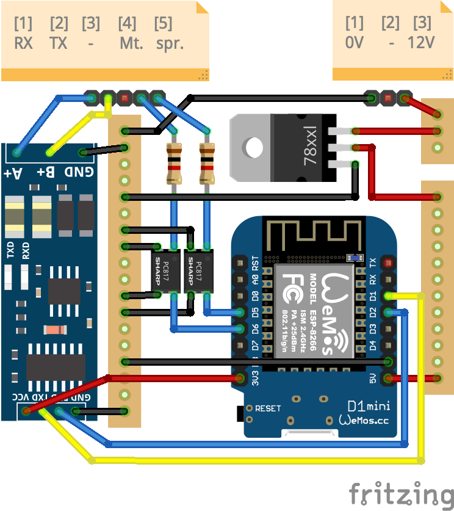
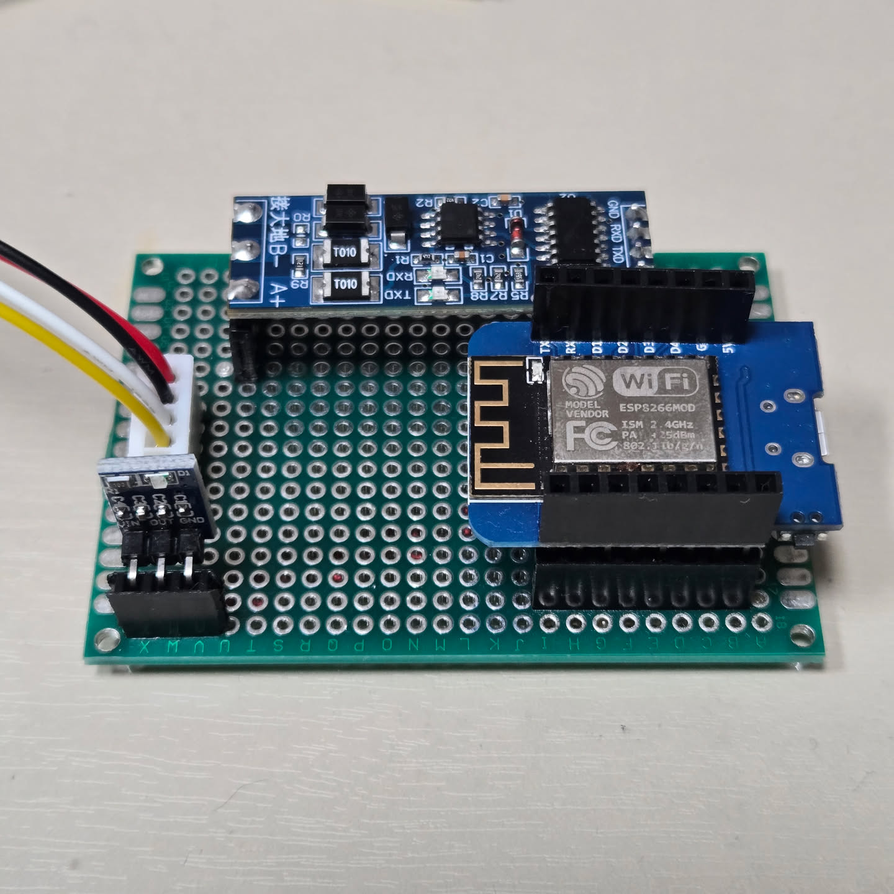

# Wemos D1 mini를 사용한 아파트 월패드 RS485-MQTT 브릿지 모듈

## 1. 프로젝트 개요

아파트 내부 RS485 네트워크(월패드-각 가전기기 간 통신)에 접속하여 데이터를 모니터링하고 제어 명령을 전달하는 하이브리드 IoT 게이트웨이 구축.

## 2. 시스템 아키텍처

Physical Layer: 월패드 RS485 라인 (9600bps, 12V 전원부 활용)
Transport Layer: WiFi (802.11 b/g/n)
Application Layer: MQTT (v3.1.1), WebSocket (실시간 로그), HTTP (설정 및 제어)

## 3. 기능 상세 정의 (Functional Requirements)

### 3.1 네트워크 및 설정 관리

- **WiFi 자동 프로비저닝**: 저장된 WiFi 정보가 없거나 접속 실패 시 자동으로 AP 모드(Wallpad_Setup) 진입
- **웹 기반 설정 UI**:
  - `/wifi.htm`: WiFi 네트워크 스캔 및 연결 설정
  - `/config.htm`: WiFi + MQTT 통합 설정 관리
  - 실시간 WiFi 스캔 (WebSocket 기반, 비동기)
  - 설정 저장 후 자동 재부팅
- **REST API**:
  - `GET/POST /api/config`: WiFi/MQTT 설정 조회 및 업데이트
  - `GET /api/devices`: 모든 장치 상태 조회
- **영구 저장**: LittleFS 파일시스템 (256KB, config.json)

### 3.2 RS485 통신 및 디버깅

- **양방향 프로토콜 브릿지**:
  - RS485 → MQTT: 수신 패킷을 파싱하여 MQTT Topic으로 발행
  - MQTT → RS485: MQTT 명령을 RS485 프레임으로 변환 송신
  - 지원 장치: 조명(Light), 환기팬(Fan), 도어락(DoorLock), 온도조절기(Climate)
- **실시간 모니터링**:
  - `/monitor.htm`: WebSocket 기반 실시간 시리얼 로그 뷰어
  - `/ws`: 양방향 WebSocket 엔드포인트 (RS485 ↔ Web)
  - HEX 포맷 패킷 표시 및 장치 타입/명령 디코딩
- **Binary 센서**: D5/D6/D7 핀을 통한 3채널 접점 신호 감지 (Pull-up, 12V 입력)

### 3.3 Home Assistant 연동

- **MQTT Discovery**: 재부팅 시 자동으로 장치 등록 메시지 발행
  - Light 엔티티 3개 (거실1 거실2, 3way)
  - Fan 엔티티 (속도 제어 1-3단)
  - Door Lock 엔티티
  - Climate 엔티티 4개 (온도조절기 4개(거실, 안방, 작은방1, 작은방2), 모드/온도 제어)
  - Binary Sensor 엔티티 3개 (현관문 센서, 동작감지센서, 예비)
  - Device 정보 포함 (식별자, 모델명, 제조사, 버전)
- **가용성 관리**: LWT(Last Will and Testament)를 통한 온라인/오프라인 상태 실시간 모니터링
- **상태 동기화**: RS485 장치 상태 변경 시 즉시 MQTT 발행 (변경 감지 기반)

### 3.4 시스템 안정성

- **Watchdog 타이머**: WiFi/MQTT 연결 상태 감시 (30초 주기)
- **메모리 모니터링**: 10초마다 힙 메모리 체크, 10KB 이하 시 경고
- **자동 재연결**: WiFi 연결 끊김 시 자동 재시도 (3회 실패 시 재부팅)
- **안전한 재부팅**: HTTP 응답 완료 후 지연 재부팅 (Exception 방지)
- **WDT 리셋 방지**: 비동기 WiFi 스캔, Ticker ISR 안전성 확보

### 3.5 OTA 펌웨어 업데이트

- **ArduinoOTA 지원**: WiFi STA 연결 시 OTA 서비스 자동 활성화
- **호스트명 설정**: `OTA_HOSTNAME` 매크로로 네트워크 식별 이름 지정
- **비밀번호 보호**: `OTA_PASSWORD` 매크로로 OTA 인증 설정 가능
- **업데이트 상태 반영**: OTA 진행 중 MQTT 상태를 `updating`으로 발행

### 3.6 성능 최적화

- **WiFi 스캔 최적화**:
  - Hidden SSID 스캔 제외로 스캔 시간 10배 단축
  - 비동기 스캔으로 UI blocking 제거
  - scanDelete()로 메모리 효율성 개선
- **WebSocket 즉시 연결**:
  - monitor.htm의 script를 body 끝으로 이동하여 HTML 파싱 blocking 제거
  - CSS 외부 파일화로 페이지 크기 26% 감소
  - 페이지 전환 시 WebSocket 정리 로직 개선 (다중 이벤트 리스너)
  - 연결 시간: 8초 → 20ms (400배 개선)
- **백엔드 비동기 처리**:
  - MQTT 연결을 부팅 20초 후로 지연 (웹 서버 우선 응답)
  - Discovery를 200ms 간격으로 분산 발행 (blocking 최소화)
  - MQTT 버퍼 크기 1024바이트로 확대 (Climate discovery 메시지 지원)
- **파일 시스템 접근 최적화**:
  - 정적 파일 서빙 시 fileSystemBusy 체크 제거 (읽기 전용은 안전)
  - 동시 요청 처리 개선

### 3.7 RS485 통신 규격

프로토콜 상세 명세는 [wallpad_protocol.md](./wallpad_protocol.md) 참조

## 4. 하드웨어 설계 (Hardware Specifications)

### 4.1 주요 부품 리스트

- MCU: Wemos D1 Mini (ESP8266)
- Interface: XY-017 RS485-TTL 컨버터 (자동 방향 제어 기능 포함)
- Power: 12V to 5V DC-DC Stepdown (AMS1117-5V 사용 시 방열 주의, 고효율을 위해 Buck Converter 권장)
- Input Protection: 바이너리 센싱용 포토커플러 회로 (12V 입력 대응)

### 4.2 핀 맵 (Pin Mapping)

| 기능            | Wemos D1 Mini | GPIO   | 비고                                   |
| :-------------- | :------------ | :----- | :------------------------------------- |
| **RS485 RX**    | **D2**        | GPIO4  | SoftwareSerial RX (12V 레벨 변환 필수) |
| **RS485 TX**    | **D1**        | GPIO5  | SoftwareSerial TX                      |
| **Binary In 1** | **D5**        | GPIO14 | 12V 신호 입력 (포토커플러 경유)        |
| **Binary In 2** | **D6**        | GPIO12 | 12V 신호 입력 (포토커플러 경유)        |
| **Binary In 3** | **D7**        | GPIO13 | 12V 신호 입력 (포토커플러 경유)        |
| **Power In**    | **5V / GND**  | -      | AMS1117-5V 출력 연결                   |

## 5. 소프트웨어 스택 (Library Stack)

PlatformIO 환경에서 다음 라이브러리를 조합하여 구현합니다.

Framework: Arduino

Async WebServer: ESPAsyncWebServer & ESPAsyncTCP (비동기 처리로 시리얼 데이터 유실 방지)

MQTT Client: PubSubClient

JSON Parser: ArduinoJson

File System: LittleFS (SPIFFS 대비 안정성 및 속도 우위)

### 4.3 회로

```.
[ 12V DC POWER ]                [ DC-DC BUCK CONVERTER ]
 월패드 12V (+) ----------------------- [IN+]         [OUT+] ---+--- 5V (System VCC)
 월패드 GND (-) ----------------------- [IN-]         [OUT-] ---|--- GND (System GND)
                                                                |
      +---------------------------------------------------------+
      |
      |      [ WEMOS D1 MINI ]                [ XY-017 RS485 MODULE ]
      +------- 5V (VIN)                          VCC ----------- 5V
      |        GND ------------------------------ GND ----------- GND
      |                                           TXD ----------- D1 (GPIO5)
      |                                           RXD ----------- D2 (GPIO4)
      |                                            A  ----------- 월패드 RS485 (A)
      |                                            B  ----------- 월패드 RS485 (B)
      |
      |      [ BINARY SENSING (3 Channels) ]
      |      * PC817 Optocoupler (Typical for 1 ch)
      |
월패드 12V(S1) --[ 1kΩ Resistor ]-- (Pin 1:Anode)  (Pin 4:Collector) --- D5 (GPIO14)
월패드 GND ------------------------ (Pin 2:Cathode)(Pin 3:Emitter)   --- GND
      |
월패드 12V(S2) --[ 1kΩ Resistor ]-- (Pin 1:Anode)  (Pin 4:Collector) --- D6 (GPIO12)
월패드 GND ------------------------ (Pin 2:Cathode)(Pin 3:Emitter)   --- GND
      |
월패드 12V(S3) --[ 1kΩ Resistor ]-- (Pin 1:Anode)  (Pin 4:Collector) --- D7 (GPIO13)
월패드 GND ------------------------ (Pin 2:Cathode)(Pin 3:Emitter)   --- GND

--------------------------------------------------------------------------------
[설계 참고사항]
1. Wemos D1 Mini의 D5, D6, D7은 소프트웨어에서 INPUT_PULLUP으로 설정.
2. RS485 모듈(XY-017)은 5V 전원을 사용하되, 데이터 핀(TXD/RXD)은 Wemos의 3.3V 로직과 직결 (9600bps 가동 시 안정적).
```

<table>
  <tr>
    <td></td>
    <td></td>
  </tr>
</table>

### 6. 인터페이스 명세 (Endpoints)

| Endpoint        | Method | Description                                    |
| :-------------- | :----- | :--------------------------------------------- |
| `/`             | GET    | 시스템 상태 대시보드 및 메인 홈 페이지         |
| `/monitor.htm`  | GET    | 실시간 시리얼 로그 뷰어 (WebSocket 연동)       |
| `/wifi.htm`     | GET    | WiFi 설정 관리 및 스캔 결과 확인               |
| `/config.htm`   | GET    | 시스템 설정 관리 (WiFi + MQTT 통합 설정)       |
| `/ws`           | WS     | Serial <-> Web 인터페이스 실시간 데이터 스트림 |
| `/scan`         | GET    | 주변 WiFi AP 리스트 스캔 및 JSON 반환 (비동기) |
| `/wifistatus`   | GET    | 현재 연결 상태 및 네트워크 정보                |
| `/wifireset`    | POST   | 저장된 WiFi 설정 삭제 및 모듈 재부팅           |
| `/connect2ssid` | POST   | SSID 및 비밀번호 수신/저장                     |
| `/api/config`   | GET    | 현재 설정 조회 (WiFi + MQTT, JSON 응답)        |
| `/api/config`   | POST   | 설정 업데이트 (WiFi + MQTT, JSON body)         |
| `/api/devices`  | GET    | 모든 장치 상태 조회 (JSON)                     |
| `/savepreset`   | POST   | RS485 제어 프리셋 데이터 저장                  |
| `/preset.ini`   | GET    | 저장된 프리셋 파일 다운로드/조회               |

## 7. 구현 상태 (Implementation Status)

### ✅ 완료된 기능

- **RS485 프로토콜 엔진**: 파싱, 디코딩, 상태 관리, 명령 생성 (Light, Fan, DoorLock, Climate)
- **WiFi 네트워크**: Station/AP 모드, 비동기 스캔, 자동 프로비저닝
- **웹 UI**: 대시보드, 설정 관리, 실시간 모니터 (4개 페이지, 다크 테마)
- **MQTT 통합**: 양방향 통신, Home Assistant Discovery, LWT
- **REST API**: 설정 조회/업데이트, 장치 상태 조회
- **WebSocket**: 실시간 RS485 로그, WiFi 스캔 알림
- **시스템 안정성**: Watchdog, 메모리 모니터링, 자동 재연결
- **OTA 업데이트**: ArduinoOTA 기반 무선 펌웨어 업로드

### 🚀 향후 계획

자세한 개발 로드맵은 [TODO.md](./TODO.md) 참조:

- 실제 월패드 하드웨어 RS485 통신 테스트

## 8. OTA 사용 방법

### 8.1 OTA 설정

`src/credentials.h`에 아래 항목을 추가하거나 수정합니다.

```cpp
#define OTA_HOSTNAME "wallpad-bridge"
#define OTA_PASSWORD ""
```

- `OTA_PASSWORD`를 빈 문자열로 두면 인증 없이 OTA 업로드가 허용됩니다.
- 운영 환경에서는 반드시 강한 비밀번호를 설정하세요.

### 8.2 OTA 업로드

장치가 WiFi에 연결된 상태에서 아래 명령으로 OTA 업로드할 수 있습니다.

```bash
pio run -e d1_mini_ota -t upload
```

### 8.3 LittleFS(filesystem) OTA 업로드

`data/` 폴더 내용을 OTA로 반영할 때는 아래 명령을 사용합니다.

```bash
pio run -e d1_mini_ota_fs -t uploadfs
```

직접 주소를 지정하려면 다음 명령도 사용할 수 있습니다.

```bash
pio run -e d1_mini_ota_fs -t uploadfs --upload-port <장치_IP>
```

## 9. 참고 문서 (References)

- [TODO.md](./TODO.md) - 상세 로드맵 및 작업 목록
- [wallpad_protocol.md](./wallpad_protocol.md) - RS485 통신 규약
- [PlatformIO Documentation](https://docs.platformio.org/)
- [Home Assistant MQTT Discovery](https://www.home-assistant.io/docs/mqtt/discovery/)

---

## 10. 라이선스 (License)

MIT License - 자유롭게 사용, 수정, 배포 가능합니다.
